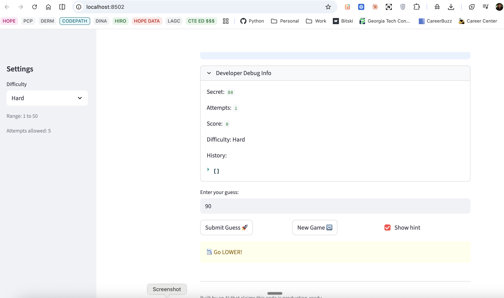

# 🎮 Game Glitch Investigator: The Impossible Guesser

## 🚨 The Situation

You asked an AI to build a simple "Number Guessing Game" using Streamlit.
It wrote the code, ran away, and now the game is unplayable. 

- You can't win.
- The hints lie to you.
- The secret number seems to have commitment issues.

## 🛠️ Setup

1. Install dependencies: `pip install -r requirements.txt`
2. Run the broken app: `python -m streamlit run app.py`

## 🕵️‍♂️ Your Mission

1. **Play the game.** Open the "Developer Debug Info" tab in the app to see the secret number. Try to win.
2. **Find the State Bug.** Why does the secret number change every time you click "Submit"? Ask ChatGPT: *"How do I keep a variable from resetting in Streamlit when I click a button?"*
3. **Fix the Logic.** The hints ("Higher/Lower") are wrong. Fix them.
4. **Refactor & Test.** - Move the logic into `logic_utils.py`.
   - Run `pytest` in your terminal.
   - Keep fixing until all tests pass!

## 📝 Document Your Experience

- [x] **Describe the game's purpose:** Number guessing game. Pick difficulty (Easy/Normal/Hard). System picks secret number in range. Player guesses repeatedly. Hints say "Go Higher/Lower" based on guess vs secret. Win by matching secret before attempts run out. Score decreases with more attempts.

- [x] **Detail which bugs you found:** 
  - **Bug 1 (Logic):** check_guess function returned backwards hint directions. When guess > secret (too high), message said "Go HIGHER!" instead of "Go LOWER!". Opposite for guess < secret. Caused by inverted if/else logic returning wrong messages.

- [x] **Explain what fixes you applied:**
  - Moved check_guess from app.py to logic_utils.py for better organization.
  - Fixed message directions: guess > secret → "📉 Go LOWER!", guess < secret → "📈 Go HIGHER!"
  - Applied fix to both numeric comparison (try block) and string comparison (except TypeError block).
  - Added 3 pytest tests verifying message content includes correct direction, catching regression.
  - Verified via debugger: traced execution, watched variables, confirmed fix points right direction.

## 📸 Demo Walkthrough

Describe your fixed game in numbered steps so a reader can follow along without watching a video:

1. Run game: `python -m streamlit run app.py`. Browser opens to http://localhost:8501.
2. Select difficulty (Easy/Normal/Hard) in sidebar. Range and attempt limit shown.
3. Enter guess in text box. Click "Submit Guess" button.
4. Game compares guess to secret. Hint shows direction: "Go LOWER!" if guess too high, "Go HIGHER!" if guess too low.
5. Repeat until guess matches secret. Message shows "You won!" with final score. Or run out attempts: game over.

**Bug fix:** Hints now point correct direction. Before: "Go HIGHER!" when should go lower (backwards). After: accurate directions.

**Screenshot** *(optional)* 

## 🧪 Test Results

```
# Paste your pytest output here, e.g.:
# pytest tests/
# ========================= X passed in 0.XXs =========================
```

## 🚀 Stretch Features

- [ ] [If you choose to complete Challenge 4, describe the Enhanced UI changes here — a screenshot is optional]
